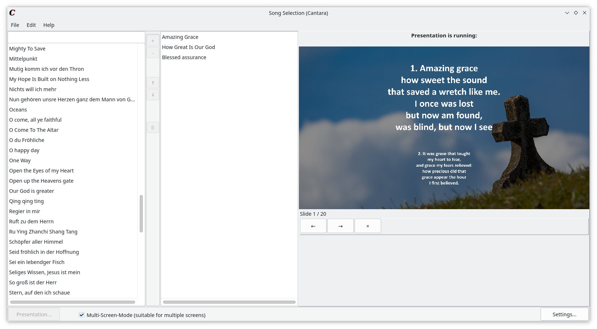

# Cantara

**Hint**: This is just the repository for the source code. For general information, please consider the [webpage](https://reckel-jm.github.io/cantara-song) with a complete documentation and instruction on downloading and installing.

**Pull Requests or issues** with bug reports, suggestions or general feedback are very appreciated!

If you like the project, please consider giving to *star* it on Github!

## About the program
Cantara is a simple open source song presentation software written in Free Pascal/Lazarus which allows people to spontanously present song lyrics for a bigger audience for the purpose of singing together. This is especially useful for church groups and meetings. 

More pictures are in the [screenshots/](screenshots/)-Folder.

## Current Version
The current version is 2.3.2 released at October 11, 2022. Go to the [release section](https://github.com/reckel-jm/cantara/releases/tag/v2.3.2) to download the binaries for a productive use of the software.
The master branch of this repository contains the latest commits which were already tested and **should** work, but are not officially released yet. If you clone from master, you might expect bugs, misbehavior or other errors when running the application. If you find any of them, please feel free to report them as a Github issue!

Cantara is also available at the snapstore. The edge version contains the latest commit to the master branch.

## Download and Installation

There are various ways how to download and install Cantara. For a detailed explenation, please check out the docs. [In the "Releases" section of this repository](https://github.com/reckel-jm/cantara/releases) there are several binary downloads for different operating system. You can also find Cantara in the [Snap Store](https://snapcraft.io/cantara). Use the 'edge' channel to get the build from the last master commit of this repository.

If you would like to compile the latest not stable state in the master brunch, you need to do the following:

 1. Download and install the [Lazarus IDE](https://www.lazarus-ide.org) – either via your distribution or their homepage.
 2. Clone the Github repository:

    `git clone git@github.com:reckel-jm/cantara.git`

 3. Open the `lazarus.lpi` file *as a project* in Lazarus and compile it **or** use `lazbuild` for the compilation via the command line:

`lazbuild -B Cantara.lpi`

On Linux, you can change the used graphical framework via the `--ws=qt5` or `--ws=gtk2` option.

**Warning: The state of the master brunch is not stable and not ready for productive use yet! If you want a stable version, please go to the releases section.**

## Song templates
Please consult the [documentation](https://www.cantara.app/tutorial/where-to-get-the-songs/) for learning which song formats are supported and where to get songs from.

At the moment an other [GitHub Repository with public domain Christian song lyrics is under construction](https://github.com/reckel-jm/cantara_songrepo), which can be directly imported to Cantara.

## Settings
The color, background and font of the presentation can be changed in the settings.

## Contribution

A big thanks to the following users who helped improving Cantara:

* @[freundTech](https://github.com/freundTech): helping with preparing the program for flatpak
* @[primores-resugendi](https://github.com/primores-resugendi): Contributing traditional Chinese translation

## Licence
The program is licenced under GPL3. See [COPYING](https://github.com/reckel-jm/cantara/blob/master/COPYING) for details. You may use and change this software and it's source code and share it as you wish, but you need to add a copyright hint and keep the licence.
